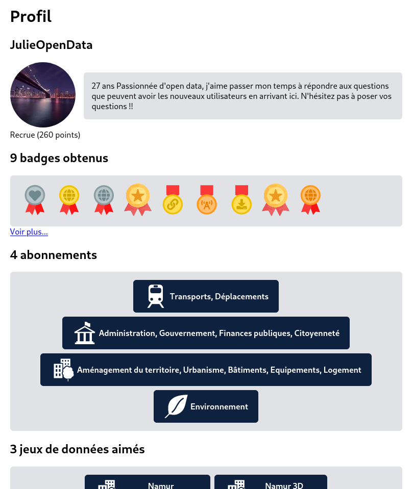

# OpenData

## C'est quoi ?

Une [plateforme d'_open data_](https://fr.wikipedia.org/wiki/Donn%C3%A9es_ouvertes) avec un twist, [la _gamification_](https://fr.wikipedia.org/wiki/Ludification).

## Comment lancer le projet sur ma machine ?

### Installer les dépendances

D'abord, installez poetry en suivant les instructions de cette [page](https://python-poetry.org/docs/#installation). C'est un outil qui nous permet de gérer facilement les dépendances du projet.

Ensuite, depuis le dossier open_data, démarrez une invite de commande/shell (Sur Windows, `⊞`+`R`, puis entrer `cmd`).

Exécutez la commande [`poetry shell`](https://python-poetry.org/docs/cli/#shell) qui génère une nouvelle invite de commande utilisant un environnement virtuel python avec toutes les dépendances du projet.

Puis, [`poetry install`](https://python-poetry.org/docs/cli/#install) qui va installer les dépendances.

### Charger les jeux de données et les thèmes de data.namur.be

Ne pas oublier de migrer la base de données avec `manage.py migrate` et créer l'administrateur `manage.py createsuperuser`.

`manage.py load_themes` charge tous les thèmes.

`manage.py load_datasets` charge tous les jeux de données (attention, cela prend un peu de temps).

Si vous souhaitez simplement avoir une base de données d'aperçu, et au lieu d'utiliser les commandes précédentes, vous pouvez charger des données d'exemple en utilisant `manage.py loaddata fixtures/example.json`. Il s'agit de données factices prêtes à être employées. Pour plus d'informations, veuillez vous référer à [la documentation de Django](https://docs.djangoproject.com/fr/3.2/howto/initial-data/#providing-data-with-fixtures).

### Démarrer le serveur

Utilisez `manage.py runserver`, rendez-vous ensuite sur http://127.0.0.1:8000.

Cette configuration est utilisable en développement mais pas en production. Pour cela, veuillez vous renseigner dans [la documentation de Django](https://docs.djangoproject.com/fr/3.2/howto/deployment/).

## Comment ça marche ?

Si vous souhaitez des informations sur le fonctionnement interne de la plateforme, vous pouvez consulter [la documentation](open_data).

## Licence

Ce projet est publié sous la licence MIT. Vous êtes donc libres de le copier, modifier, distribuer, ou vendre sous la seule condition de citer ses auteurs originaux.

&copy; 2021, Martin Balfroid, Maxime Caucheteur, Jonathan Ferreira, Germain Herbay, Loris Hincq, Pierre Luycx
