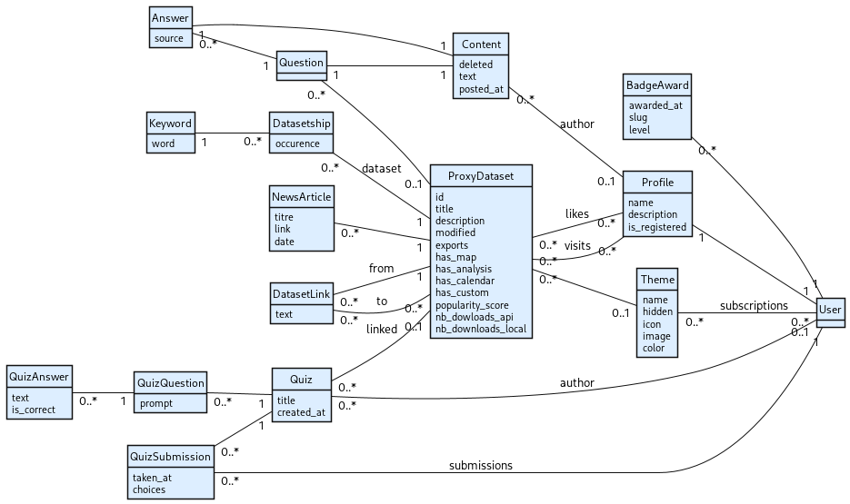

# OpenData

## Applications

Le projet est divisé en 5 applications. Elles sont décrites ci-dessous :

| Application        | Description                                                                                                              |
| ------------------ | ------------------------------------------------------------------------------------------------------------------------ |
| [app](app)         | Application principale contenant la page d'accueil, les différents popups et dropdowns, ainsi que le tableau des scores. |
| [badge](badge)     | Tout ce qui concerne le décernement de badges aux utilisateurs.                                                          |
| [dataset](dataset) | Tout ce qui concerne la consultation des différents thèmes et jeux de données disponibles sur la plateforme.             |
| [quiz](quiz)       | Tout ce qui concerne la création de quiz et la soumission de réponses.                                                   |
| [user](user)       | Tout ce qui concerne la gestion des utilisateurs et de leurs profils.                                                    |

## Base de données

